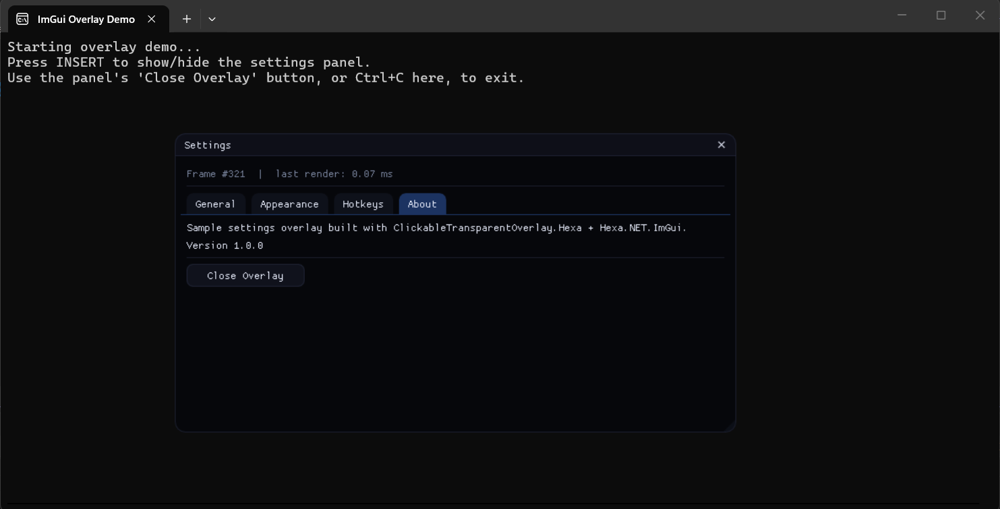

# 📌ImGuiOverlay
Sample settings overlay built with ClickableTransparentOverlay.Hexa + Hexa.NET.ImGui

## :bookmark:Credits
- [Hexa.NET.ImGui](https://github.com/HexaEngine/Hexa.NET.ImGui) - A .NET wrapper for the Dear ImGui library
- [ClickableTransparentOverlay.Hexa](https://github.com/xfi0/ClickableTransparentOverlay.Hexa) - A library for creating clickable transparent overlays on Windows using Hexa.NET.ImGui